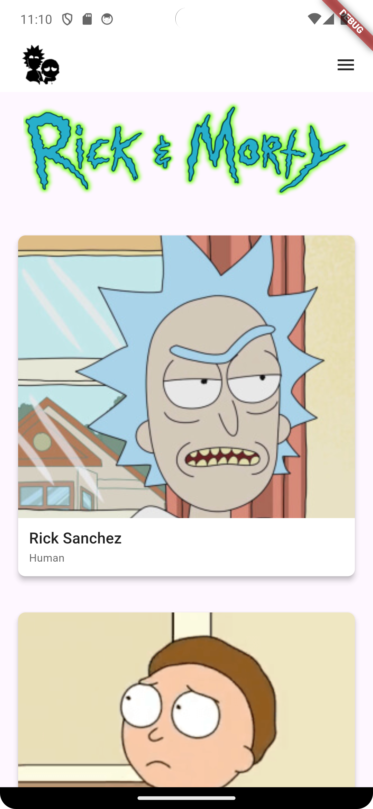
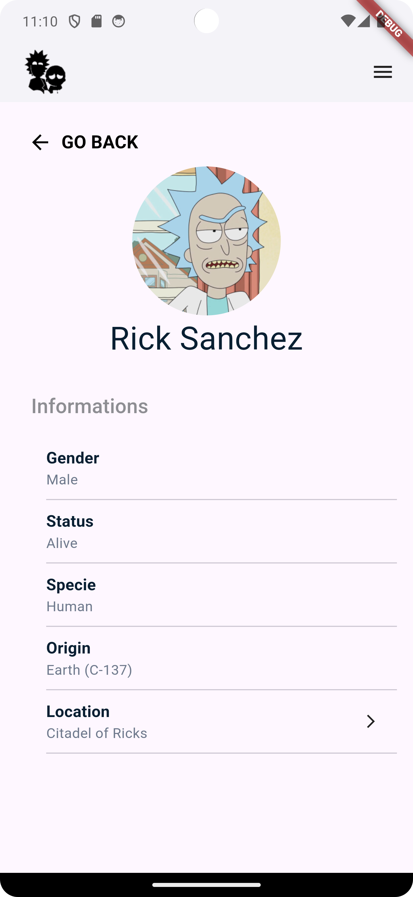

# Rick and Morty App

Este aplicativo Flutter busca e exibe informações de personagens da . O aplicativo suporta rolagem infinita e permite aos usuários visualizar informações detalhadas sobre cada personagem. Me baseei no design desse -(Community)?node-id=20-110&t=mjn6fYv6amsQ5Q0N-0).

## Tabela de Conteúdos

1. [Recursos](#recursos)
2. [Capturas de Tela](#capturas-de-tela)
2. [Instalação](#instalação)
3. [Uso](#uso)
4. [Integração com API](#integração-com-api)

## Recursos

- Rolagem infinita para carregar mais personagens conforme o usuário rola para baixo.
- Exibe detalhes do personagem, como nome, gênero, status, espécie, origem e localização.
- Fornece uma visão detalhada de cada personagem quando selecionado.

## Capturas de Tela

## Instalação

1. **Clone o repositório**
2. **Instale as dependências com flutter pub get**
3. **Execute o aplicativo com flutter run**

## Uso
Após iniciar o aplicativo, você pode:

- Rolar para baixo para carregar mais personagens.
- Tocar em um personagem para ver informações mais detalhadas sobre ele.

## Integração com API
O aplicativo busca dados da API Rick and Morty. A seguinte função é usada para interagir com a API:

- fetchDataCharacters(int page): Busca uma lista de personagens da página recebida na chamada da função.